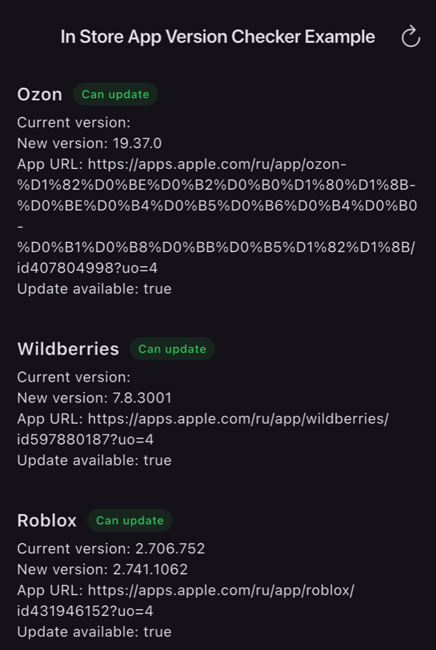

# flutter_in_store_app_version_checker

[](https://pub.dev/packages/flutter_in_store_app_version_checker)
[](https://pub.dev/packages/flutter_in_store_app_version_checker/score)
[](https://pub.dev/packages/flutter_in_store_app_version_checker/score)
[](https://pub.dev/packages/flutter_in_store_app_version_checker)
[](https://codecov.io/gh/ziqq/flutter_in_store_app_version_checker)
[](https://github.com/ziqq/flutter_in_store_app_version_checker)

Find out whether a newer version of your app is published on **Google Play**, **ApkPure** or the **Apple App Store** — with one call and no backend.

```dart
final res = await InStoreAppVersionChecker.instance.checkUpdate(
  const InStoreAppVersionCheckerParams(locale: 'en-US'),
);
if (res.canUpdate) showUpdateDialog(res.newVersion, res.appURL);
```




## Features

- 🔍 **One call** — returns the installed version, the store version, the store URL and whether an update is available.
- 🏪 **Google Play, ApkPure and App Store** out of the box.
- 🌍 **Regional storefronts** — check the App Store / Google Play for a specific country and language.
- 🧮 **Semver-aware comparison** — pre-releases, build metadata and `1.2` vs `1.2.0` are handled correctly.
- 🪶 **Lightweight** — depends only on `http` and `meta`; installed app metadata is read by the plugin's own native code, no `package_info_plus` required.
- 🧪 **Testable** — inject your own `http.Client`; well covered by unit tests.


## Getting started

### Install

```bash
flutter pub add flutter_in_store_app_version_checker
```

Requirements: Flutter `>=3.44.0`, Dart `>=3.12.0 <4.0.0`.

### Supported platforms

| Platform | Stores                |
|----------|-----------------------|
| Android  | Google Play, ApkPure  |
| iOS      | Apple App Store       |

Other platforms (Web, Windows, Linux, macOS) are not supported.


## Usage

### Check for an update

Package name and current version are read from the installed app automatically.

```dart
import 'package:flutter_in_store_app_version_checker/flutter_in_store_app_version_checker.dart';

Future<void> checkForUpdate() async {
  final res = await InStoreAppVersionChecker.instance.checkUpdate(
    const InStoreAppVersionCheckerParams(locale: 'en-US'),
  );

  if (res.isError) {
    debugPrint('Update check failed: ${res.errorMessage}');
    return;
  }

  debugPrint('Current version: ${res.currentVersion}');
  debugPrint('Store version  : ${res.newVersion}');
  debugPrint('Store URL      : ${res.appURL}');
  debugPrint('Can update     : ${res.canUpdate}');
}
```

### Show an update dialog

A typical "new version available" prompt, using [`url_launcher`](https://pub.dev/packages/url_launcher) to open the store page:

```dart
Future<void> promptUpdate(BuildContext context) async {
  final res = await InStoreAppVersionChecker.instance.checkUpdate(
    const InStoreAppVersionCheckerParams(locale: 'en-US'),
  );
  if (!context.mounted || res.isError || !res.canUpdate) return;

  await showDialog<void>(
    context: context,
    builder: (context) => AlertDialog(
      title: const Text('Update available'),
      content: Text('Version ${res.newVersion} is available. '
          'You have ${res.currentVersion}.'),
      actions: [
        TextButton(
          onPressed: () => Navigator.pop(context),
          child: const Text('Later'),
        ),
        FilledButton(
          onPressed: () => launchUrl(Uri.parse(res.appURL!)),
          child: const Text('Update'),
        ),
      ],
    ),
  );
}
```

### Use ApkPure on Android

```dart
const params = InStoreAppVersionCheckerParams(
  locale: 'en',
  androidStore: InStoreAppVersionCheckerAndroidStoreType.apkPure,
);
final res = await InStoreAppVersionChecker.instance.checkUpdate(params);
```

### Check a specific App Store country

```dart
const params = InStoreAppVersionCheckerParams(locale: 'en-AE');
final res = await InStoreAppVersionChecker.instance.checkUpdate(params);
```

This checks the UAE storefront. Choose a region where the app is available — a language alone (`en`) is not an App Store country. See [Store locale](#store-locale).

### Check another app or override the version

```dart
const params = InStoreAppVersionCheckerParams(
  locale: 'en-US',
  packageName: 'com.example.app', // bundle ID on iOS
  currentVersion: '1.2.3',
);
```

### Custom HTTP client

```dart
final checker = InStoreAppVersionChecker.instanceFor(
  httpClient: customHTTPClient,
);
final res = await checker.checkUpdate(
  const InStoreAppVersionCheckerParams(locale: 'en-US'),
);
```


## API

Entry point: [`InStoreAppVersionChecker.instance`](lib/src/in_store_app_version_checker.dart), or [`InStoreAppVersionChecker.instanceFor(httpClient: ...)`](lib/src/in_store_app_version_checker.dart) for a custom client.

### Parameters — [`InStoreAppVersionCheckerParams`](lib/src/in_store_app_version_checker_params.dart)

| Parameter        | Type                                       | Description |
|------------------|--------------------------------------------|-------------|
| `locale`         | `String` (required)                        | Store language/region, e.g. `en-US`. See [Store locale](#store-locale). |
| `packageName`    | `String?`                                  | Android package name / iOS bundle ID. Defaults to the installed app. |
| `currentVersion` | `String?`                                  | Version to compare against. Defaults to the installed app version. |
| `androidStore`   | `InStoreAppVersionCheckerAndroidStoreType` | `googlePlayStore` (default) or `apkPure`. |

If `packageName` or `currentVersion` is omitted, it is resolved from the installed app: on Android from the plugin's native implementation, on iOS from the bundle identifier and `CFBundleShortVersionString`.

### Response — [`InStoreAppVersionCheckerResponse`](lib/src/in_store_app_version_checker_response.dart)

| Field            | Description |
|------------------|-------------|
| `isSuccess` / `isError` | Whether the lookup succeeded. |
| `currentVersion` | Installed (or overridden) version. |
| `newVersion`     | Version published in the store. |
| `canUpdate`      | `true` if the store version is newer. |
| `appURL`         | Link to the store page. |
| `errorMessage`, `error`, `stackTrace` | Details for error responses. |


## Store locale

Use one regional `locale` for both platforms, for example `en-US` or `en-AE`.
Google Play uses the complete locale for its `hl` language parameter. On iOS,
the region selects the App Store storefront country; it does not automatically
detect the country of the user's App Store account.

| `locale` | Google Play `hl` | App Store country |
|----------|------------------|-------------------|
| `en-US` | `en-US` | `us` |
| `en_AE` | `en-AE` | `ae` |
| `pt-BR` | `pt-BR` | `br` |
| `zh-Hant-TW` | `zh-Hant-TW` | `tw` |
| `ru` | `ru` | `ru` (legacy country-only input) |
| `en` | `en` | Invalid country; Apple returns an error |

<details>
<summary>Locale rules in detail</summary>

Supported regional forms are `language-REGION` and `language-Script-REGION`.
Underscores are accepted as separators; surrounding whitespace and letter case
are normalized. On Google Play, other locale forms are passed through unchanged.
ApkPure ignores `locale`.

On iOS, existing two-letter country-only values such as `us`, `ae`, and `ru`
remain supported. Short values are interpreted as countries: `ar` means
Argentina, while `ar-AE` explicitly selects the UAE storefront. A language such
as `en` cannot determine a country, and the package never silently falls back
to a different storefront.

iOS rejects malformed values, locales without a country such as `zh-Hant`,
numeric regions such as `es-419`, and locale variants or extensions. This is
structural validation, not a list of supported storefronts: Apple determines
whether the requested country is supported and whether the app is available
there. See Apple's [country parameter documentation](https://developer.apple.com/library/archive/documentation/AudioVideo/Conceptual/iTuneSearchAPI/Searching.html).

</details>


## Error handling

Always check `isError` before using `canUpdate`. A failed lookup with no store
version also returns `canUpdate == false`; that alone does not mean the app is
up to date. An error response may still report `canUpdate == true` if
`newVersion` is greater.

Errors are returned (not thrown) for: invalid iOS locale structure, HTTP/network
failures, app not found in the selected storefront, and unsupported platforms.

Apple HTTP errors include the status, original locale, and resolved storefront.
HTTP 400 includes guidance to check the country code. A successful HTTP 200
response with empty results instead reports that the app was not found in that
storefront; check both its bundle ID and regional availability.


## Version comparison

<details>
<summary>How versions are compared</summary>

- Build metadata (`+build`) is ignored.
- Trailing zero segments are normalized: `1.2` equals `1.2.0` (no update).
- Release vs pre-release: a release is higher than a pre-release with the same core, so current release → new pre-release is treated as an update (legacy-compatible).
- Pre-release tokens are compared after the core version; numeric tokens numerically, mixed/alphanumeric tokens token-by-token with numeric-aware ordering.
- Fully non-numeric current vs numeric new → update; fully non-numeric new vs numeric current → no update.
- Whitespace is trimmed and non-alphanumeric symbols are stripped.

See the unit tests in [test/unit](test/unit) for the authoritative behavior.

</details>


## Platform integration notes

- Android uses Flutter 3.44+ built-in Kotlin support.
- iOS supports both Swift Package Manager (with the required `FlutterFramework` dependency in `Package.swift`) and CocoaPods.


## Migrating from 2.x

The factory-based API from 2.0.x has been removed. Use `InStoreAppVersionChecker.instance` or `InStoreAppVersionChecker.instanceFor(...)` together with `InStoreAppVersionCheckerParams`. `InStoreAppVersionChecker.custom(...)` is deprecated and forwards to `instanceFor(...)`. See the [Changelog](https://github.com/ziqq/flutter_in_store_app_version_checker/blob/main/CHANGELOG.md) for all release notes.


## Contributing

Issues and pull requests are welcome — see [CONTRIBUTING.md](CONTRIBUTING.md).
If this package saves you time, please ⭐ [star it on GitHub](https://github.com/ziqq/flutter_in_store_app_version_checker) and 👍 like it on [pub.dev](https://pub.dev/packages/flutter_in_store_app_version_checker) — it helps others find it.


## Funding

If you want to support the development of the library:

- [Buy me a coffee](https://www.buymeacoffee.com/ziqq)
- [Subscribe through Boosty](https://boosty.to/ziqq)


## Maintainers

[Anton Ustinoff (ziqq)](https://github.com/ziqq)


## License

[MIT](https://github.com/ziqq/flutter_in_store_app_version_checker/blob/main/LICENSE)


## Coverage


